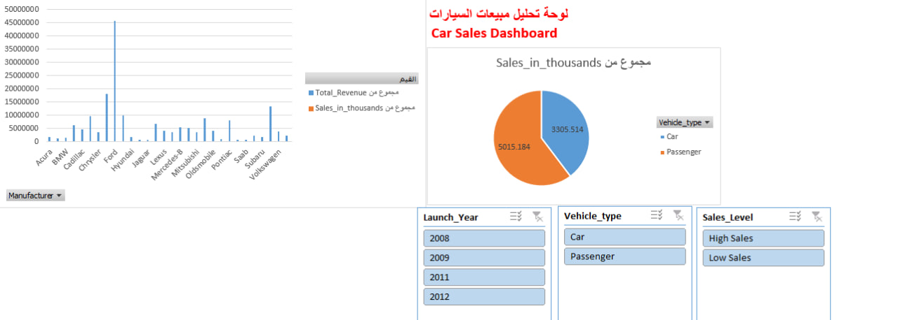

# 🚗 Car Sales Interactive Dashboard (Excel)

An end-to-end data analysis project using Microsoft Excel to analyze automotive sales, pricing, and revenue across various manufacturers and vehicle types.

---

## 📊 Project Overview
The objective of this project is to clean, transform, and analyze raw car sales data (`Car_sales.csv`) to build an **interactive Excel dashboard**. This dashboard allows decision-makers to filter sales metrics by manufacturer, vehicle type, launch year, and sales performance level.

---

## 🖼️ Dashboard Preview

---

## 🛠️ Key Tools & Excel Features
* **Data Preparation & Cleaning:** Standardized dates, converted raw ranges into dynamic Excel Tables.
* **Feature Engineering:**
  * Calculated Total Revenue: `[Sales_in_thousands] * [Price_in_thousands] * 1000`
  * Categorized Sales Levels (`High Sales` vs `Low Sales`) using conditional logic (`IF`).
  * Extracted 4-digit launch years (`Launch_Year`).
* **Data Analysis (Pivot Tables):** Grouped metrics to analyze revenue by manufacturer and average prices by vehicle type.
* **Data Visualization & Interactivity:** Built PivotCharts (Bar & Pie Charts) connected seamlessly via interactive Slicers.

---

## 💡 Key Insights
1. **Manufacturer Performance:** Leading brands generate a significantly higher proportion of overall market revenue.
2. **Vehicle Category Trend:** Passenger vehicles account for a larger share of total sales volume compared to standard cars.
3. **Interactive Filtering:** Users can dynamically explore historical sales patterns across multiple launch years (e.g., 2008–2012).

---

## 📁 Repository Contents
* `Excel Interactive Dashboard for Car Sales Data.xlsx` - Full interactive Excel model containing cleaned data, Pivot Tables, and the final Dashboard.
* `dashboard.jpg` - Visual preview of the final interactive dashboard.
